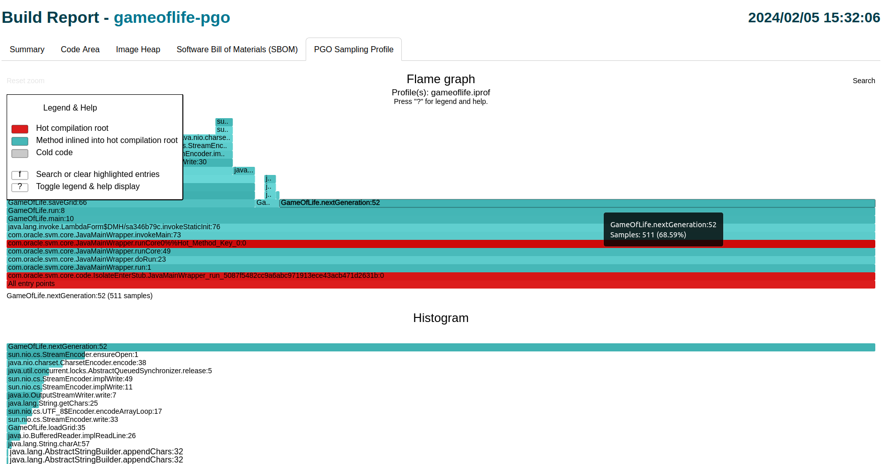
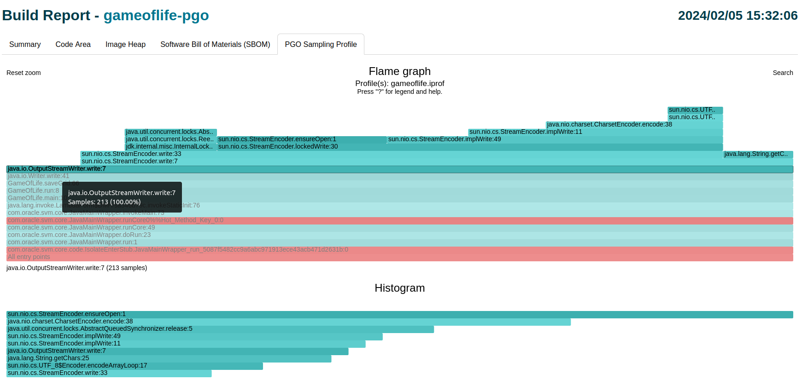
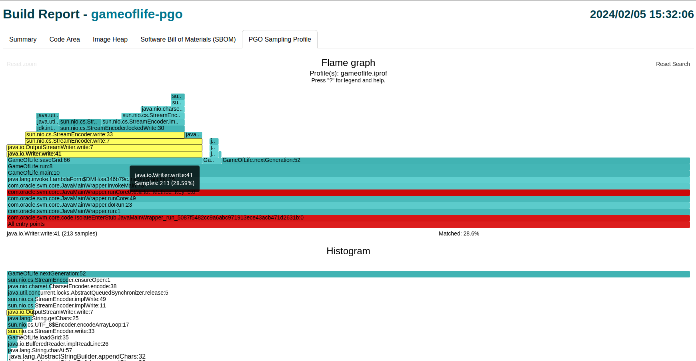

# Inspecting a Profile in a Build Report

A profile plays an essential part in efficient AOT compilation by Native Image.
It contains the information about a particular execution of the application, and is used to guide additional optimizations that
further improve application performance.
It is often useful to visualize the information in a profile.
This section explains how to inspect parts of a profile using the Native Image **Build Report** tool.

## Generating a Profile Visualization

The Build Report tool displays various data about the generated image and the build process itself.
Among other things, the tool can visualize profiling information recorded by the sampler, which is useful for exploring how different methods contribute to overall execution time.
The samples are aggregated into a single _flame graph_. 
The flame graph is color-coded to show how the inliner made the inlining decisions during the compilation (more on that below).

To generate a comprehensive report with the visualization, pass the `-H:+BuildReport` and `-H:+BuildReportSamplerFlamegraph` options at the step when you build a PGO-optimized native executable.
For example:
```bash
native-image -cp . GameOfLife -o gameoflife-pgo --pgo=gameoflife.iprof -H:+BuildReport -H:+BuildReportSamplerFlamegraph
```
> Refer to [Basic Usage of Profile-Guided Optimization](PGO-Basic-Usage.md) for the step-by-step guide.

## Inspecting a Profile Using a Build Report

Profiling information recorded by the Native Image sampler is visualized in form of a flame graph - a hierarchical chart that aggregates multiple stack traces.
This flame graph is specialized in differentiating "hot" vs. "cold" compilation units.
There are three distinct colors:
- **red**: used for marking root methods of hot compilation units;
- **blue**: used for all the methods inlined into a hot compilation root;
- **gray**: represents the "cold" code.

> Note: The color descriptions and other useful information are part of a chart legend, and can be toggled by clicking "?".



The graph itself provides a couple of functionalities. 
A user can hover over a specific method bar to see more information about that method, for example, a number of samples and the percentage related to the total number of samples. 
Besides that, there is the ability to "zoom" into a particular method (by clicking on it) and see all the subsequent calls in that call chain more clearly. 
One can reset the view using the **Reset Zoom** button in top-left corner.



Additionally, there is a search button (**Search**) located in top-right corner of the graph.
It can be used to highlight a specific method or a group of methods that match the search criteria (the method(s)
will be colored yellow).
Also, there is a **Matched** field that represents the group share in the total number of samples (showed underneath the chart in the right half). 
Note that this is also a relative share - it will be readjusted when expanding/collapsing the view.
One can also use a **Reset Search** button to cancel the search at any time.



The flame graph comes with the additional histogram (below it). 
It shows the individual methods' contributions to the total execution time (descending by the number of samples). 
These bars are also clickable, and the click has the same effect as searching - it highlights that particular method in
the flame graph above. 
Additional click on that same bar resets the highlighting.


### Further Reading

* [Tracking Profile Quality](PGO-Profile-Quality.md)
* [Merging Profiles from Multiple Sources](PGO-Merging-Profiles.md)